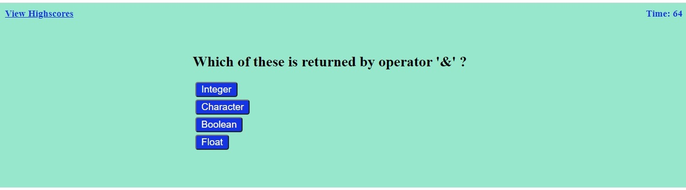

# Description
•	It will ask the 5 questions about coding.
•	The user has 75 seconds to complete the quiz
•	Every time the user selects an answer.
•	It will tell you the correct and wrong 
•	Not showing correct answer.
•	Show remaining time in seconds.
•	Your score will be displayed at the end.

# User Story
   AS A coding bootcamp student
   I WANT to take a timed quiz on JavaScript Basic that stores high scores.
   I can how many answers is right 

# Code
•	HTML
•	CSS
•	JavaScript
•	JSON

# Github:
 git@github.com:patelpr03/Code-Quiz.git

 # link to deployed application
https://patelpr03.github.io/Code-Quiz/
# screenshot : 
   
   
   
# Demo
    web-apis-homework-demo.gif

# Others Contributors:
   Andres Long
